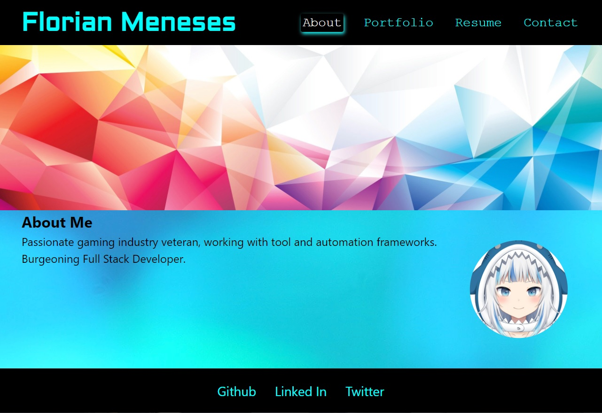

# React Portfolio

## Description:

---
This is my React Portfolio, I created this site so that I can share my work and experience from the gaming industry and tech as a developer.

## [Portfolio](https://myuze.github.io/react-portfolio-fm/)
### https://github.com/Myuze/react-portfolio-fm
---

## Table of Contents:

---
1. [Installation Instructions](#installation-instructions)
2. [Usage](#usage)
3. [Questions](#questions)

## Installation Instructions:

---
1. Install, `node.js`.
2. Clone the application repository.
3. In the repository root, in the CLI, `npm install`.

## Usage:

---
From the repository directory:
View at: https://github.com/Myuze/react-portfolio-fm
OR
1. From the CLI use, `npm start`.
2. Open the page at `localhost:3000`.

## Questions:

---

### What is your Github username?

[Myuze](https://github.com/Myuze)

### If you have any other questions, you can reach me at:

[flmeneses.dev@gmail.com](mailto:flmeneses.dev@gmail.com)
